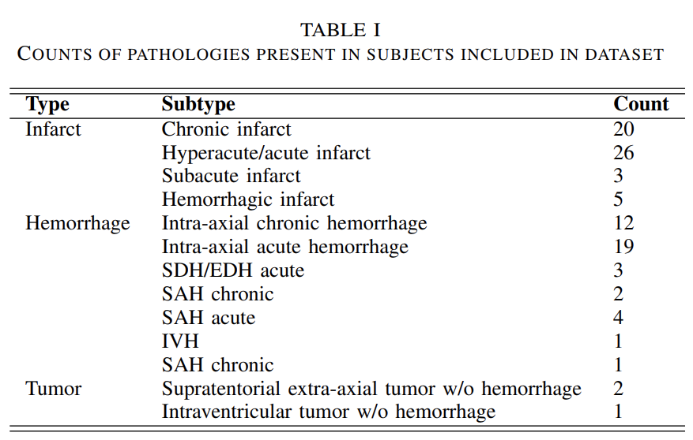
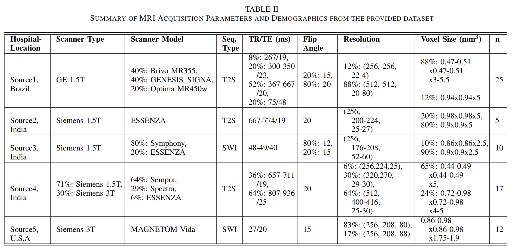
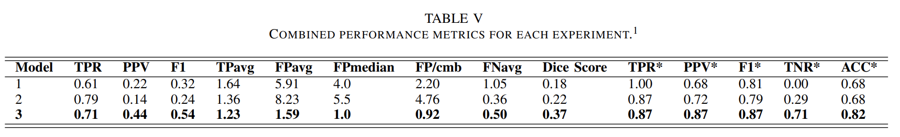
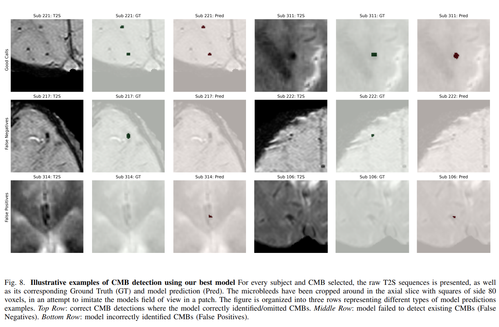

# Segmentation_CMB
NOTE: THIS REPOSITORY WILL BE CHANGED SOON TO FIT NEW CONTENT

Repository containing results of my Research Project done in collaboration with [CEREBRIU](https://cerebriu.com/) company as part of my Msc in Data Science at [IT University of Copenhagen](https://en.itu.dk/). 

Please read full report in [Automated Segmentation of CMB](JorgedelPozoLerida_ResearchProject_AutomatedSegmentationofCMB.pdf)

## Abstract
Cerebral Microbleeds (CMBs) are crucial neuroimaging biomarkers associated with medical conditions such as stroke, intracranial hemorrhage, and cerebral small vessel disease. They are detectable as hypointensities on magnetic resonance images (MRI) in T2*-weighted or susceptibility-weighted sequences. 

Identifying CMBs is a time-consuming and error-prone task for radiologists, making the need for automatic detection critical. Yet, it remains a challenging endeavor due to the small size and quantity of CMBs, scarcity of publicly available annotated data, and their resemblance to various other mimics among other things. This complexity hinders the development of a clinically integrated automated solution. 

In response to these challenges, this study carefully reviewed the literature on this topic and tested a commonly used architecture, U-Net, for the segmentation and detection of CMBs using the public VALDO dataset. Adhering to the latest research guidelines, the study achieved a recall of 0.71, a precision of 0.44, and an F1 score of 0.54, with an average of 1.5 and 0.9 false positives per subject and per CMB respectively. Concurrently, a new clinically relevant dataset specifically tailored for CMB segmentation was developed, to be utilized in future work.

## Contributions
The project's main contributions can be summarized into:
* Generating a new, clinically relevant dataset for CMB
segmentation to be used in future work.
* 3D U-Net model trained on the VALDO dataset, following latest literature guidance.

### Creation of New Dataset for CMB segmentation
A total of 70 cases were selected containing diverse pathologies and coming from different hospital locations, with equally diverse scanner acquisition parameters. This project handled the following things: annotation protocol tuning, annotation framework setup, custom algorithm to generate synthetic masks from weak annotations. 

Taxonomy used for annotation in RedBrick AI can be found here: [taxonomy_CMB.json](data/taxonomy_CMB.json) 

### 3D U-Net for CMBs segmentation   

A 3D-Unet was trained in different setups to learn the task of segmenting and detecting CMBs, achieving satisfactory results given the complexity of the task and the state-of-the-art. As with many other approaches in literature, FPs were the main problem. Because of its well-known architecture and the use of a publicly available dataset, this results can easily be compared and reproduced by other researchers who wat to approach the task.

Please find a link to best performing model [here](https://drive.google.com/file/d/1umbCrlPZDpJcdJxVQXsXap9nWH_F9pQG/view?usp=sharing)

## Repository structure overview

These files are present in root folder:
* [Project Report](JorgedelPozoLerida_ResearchProject_AutomatedSegmentationofCMB.pdf): PDF with full report of the project
* [Bibliography](bibliography.bib): bib file contianing bibliography used

The following folders are present in the repo

### [Data](data/)
Contains all light-weight files with: CMB metadata 
(counts per subject, size, location...), VALDO metadata (resolution, orientation...etc),
results from data analysis (new datatset characteristics...), logs from ClearML...etc

Note that some data used during project (e.g. experiments, models saved..etc) 
are not present in this repository due to storage limitations. 

### [Experiments](experiments/)
Configuration files for training of the different segmentation experiments in ClearML

### [Images](img/)
Images used for report

### [Scripts](scripts/)
This folder host Python scripts and notebooks and R code used for several tasks
of the project.

Script with custom implementation of Region growing and evaluaiton on VALDO dataset:
* [region_growing.ipynb](scripts/region_growing.ipynb)

Scripts used to preprocess VALDO dataset:
* [data_preprocessing.py](scripts/data_preprocessing.py)

Scripts used to extract metadata for data analysis:
* [metadata_extraction.py](scripts/metadata_extraction.py): to get raw VALDO metadata
* [metadata_extraction_from_processed.py](scripts/metadata_extraction_from_processed.py):  to get processed VALDO metadata

Scripts to perform data analysis:
* [dataset_description.R](scripts/dataset_description.R): generates summary of metadata of dataset of new creation
* [CMB_studies_selection_and_prioritization.R](scripts/CMB_studies_selection_and_prioritization.R): selects studies for new dataset creation and prioritizes them for review

Script used to generate stratified train-valid split for VALDO data:
* [generate_split.py](scripts/generate_split.py)

Scripts used to generate evaluation tables and images:
* [evaluation_analytical.ipynb](scripts/evaluation_analytical.ipynb)
* [evaluation_visual.ipynb](scripts/evaluation_visual.ipynb)

Script with some of the implementations done in ClearML:
* [random_3d_canonical_strategy.py](scripts/random_3d_canonical_strategy.py)
* [classification_evaluation.py](scripts/classification_evaluation.py) 
* [segmentation_evaluation.py](scripts/segmentation_evaluation.py) 
* [counts_evaluation.py](scripts/counts_evaluation.py)
